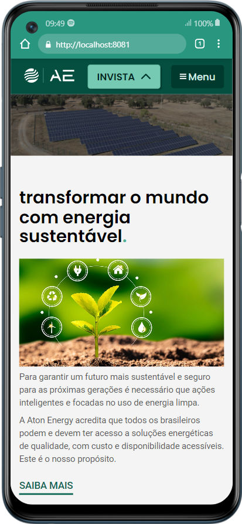
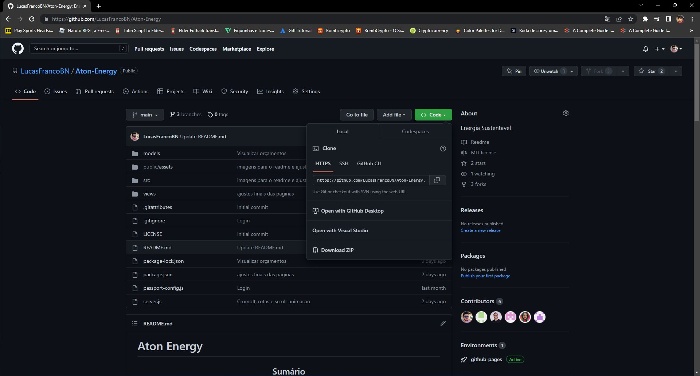

<h1>Aton Energy </h1>

<!-- LINKS -->

 
 <h2> Sumário</h2>
 
 <a href="#fotos">Fotos</a> - 
  <a href="#sobre">Sobre o Projeto</a> - 
  <a href="#tec">Tecnologias</a>
  <a href="#inst">Instalação</a>

 

<!-- FOTOS -->

    <h2> 📸 Fotos </h2>
        
          
       
 <h2> 📱 Responsivo </h2>
 
   
 

<!-- SOBRE -->

    <h2> 📝 Sobre o Projeto </h2> 
    
 Aton Energy é uma empresa sustentável que traz soluções de energia limpa e renovável para outras empresas. 

    
 Neste projeto, nós podemos criar uma conta (através do express-session), enviar um formulário para o nosso banco de dados (Sequelize e mySQL), ver os orçamentos que já foram cadastrados por você e deletar os mesmos 

    
 Nas páginas de cadastro, login, usuario, e outras diversas; todas foram criadas com EJS e usamos o Express para fazer as rotas da mesma 

 

  <h2>👨‍💻 Instalação</h2>
  
 Para instalar esse projeto, você antes deve ter instaldo o mySQL Community e Node em sua máquina. 

  
 Após instalados os dois itens citados, faça o download do zip aqui mesmo no github

  
  
 Agora faça a descompactação do mesmo, abra o seu terminal de comando, mude para o diretório em que o projeto está.  

  <pre><code>cd nome-do-diretorio</code></pre>
  
 Dê os seguintes comandos no seu terminal. 

  <pre><code>npm install</code></pre>
  
Após instalar as dependências, dê o seguinte comando no seu terminal

  <pre><code>npm run start</code></pre>

<h2> 🖥️ Tecnologias</h2>
    
 ✔️ HTML 5 

    
 ✔️ CSS 3 

    
 ✔️ JavaScript 

    
 ✔️ UI/UX Design 

    
 ✔️ Express 

    
 ✔️ Sequelize 

    
 ✔️ bcrypt 

    
 ✔️ EJS 

    
 ✔️ Passport 

